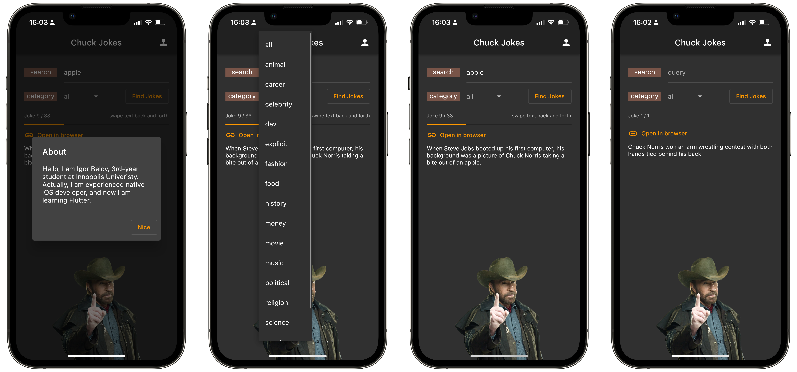

# Chuck Jokes

The application for interacting with [Chuck Norris Jokes Api](https://api.chucknorris.io)



## Features

All Basic and Advanced requirements are satisfied:

- One screen with content

- Categories support

- Joke retrieveing and displaying support (random or with category selected)

- Joke search support

- About dialog with personal information

- Support for opening a joke in the browser

- Using the image

- Support for both light and dark themes

## Packages

```yaml
dependencies:
  flutter:
    sdk: flutter
  google_fonts: 2.2.0
  dio: ^4.0.0
  json_annotation: ^4.0.1
  logger:
  url_launcher:
  cupertino_icons: ^1.0.2

dev_dependencies:
  flutter_test:
    sdk: flutter
  json_serializable: ^4.1.3
  build_runner: ^2.0.4
  flutter_lints: ^1.0.0
```